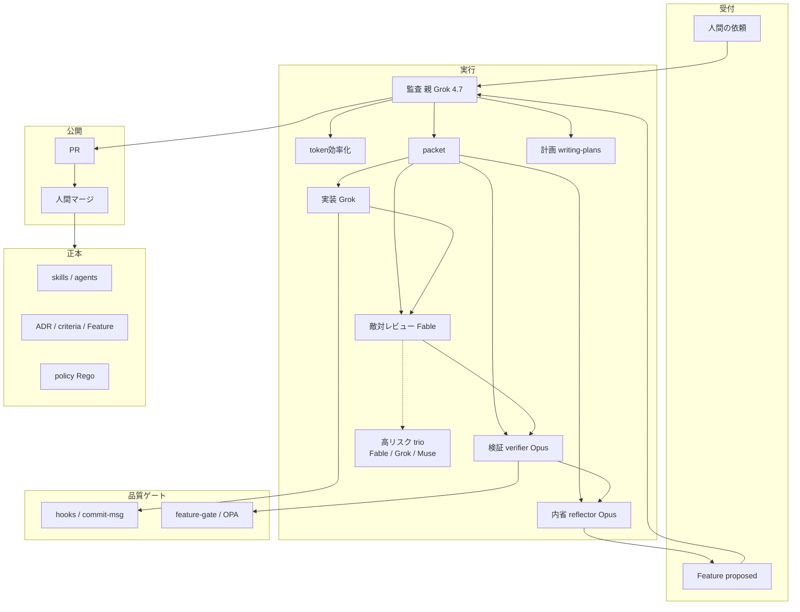
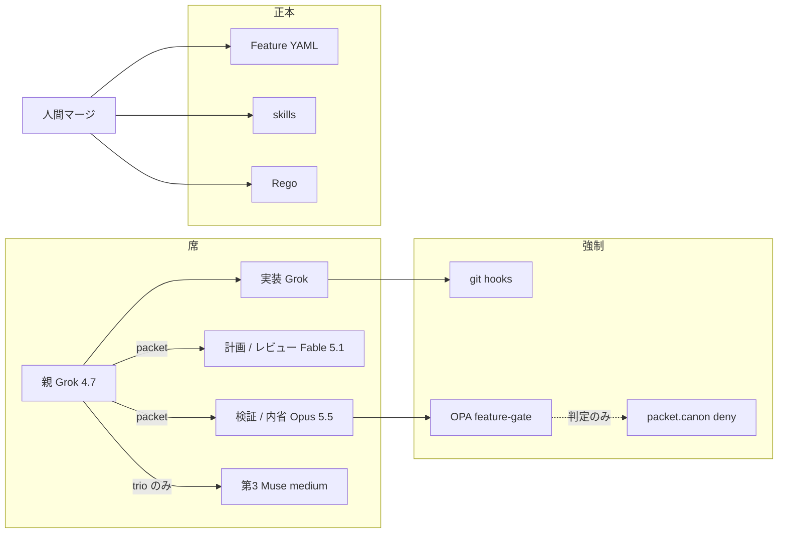
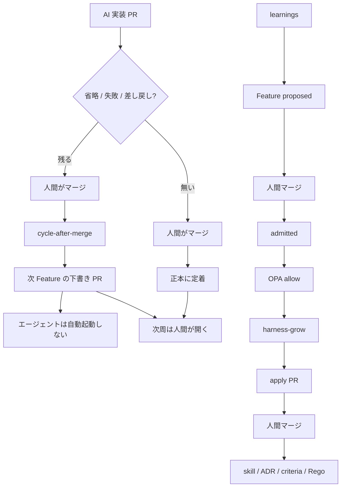

# cursor-harness

Cursor ハーネスの**テンプレート**。対象は席・正本・ゲート・cycle（[ADR 0039](knowledge/decisions/0039-harness-template-cycle-graph.md)）。
ライセンスは [MIT](LICENSE)（Copyright (c) 2026 marumo333）。

## 実行環境

開発の正は **Cursor のクラウド**（Cloud Agent）と GitHub Actions（`ubuntu-latest`）。
ゲート（`feature-gate` / OPA）は Linux amd64 にピン留めする。macOS / Windows / Linux arm64 では動かない。
手元の clone は閲覧と空リポへの載せに使う。commit とゲートはクラウドまたは Actions で通す。

## 何をするか

- 席: 親 Grok 4.7 high / 計画・レビューは Fable 5.1 / 検証は Opus 5.5 high / Muse Spark 1.3 は**高リスク3体多数決のみ**
- 正本: [`knowledge/features/F-NNNN-*.yaml`](knowledge/features/README.md)。GitHub Issues / Spec Kit は正本にしない（[ADR 0033](knowledge/decisions/0033-harness-api-budget-routing.md)）
- ゲート: OPA `node scripts/feature-gate.mjs`（自己改善ループそのものではない）
- 出生規則: Feature は `proposed` で起票する。**同一 PR で `admitted` / `approved` にしない**（[ADR 0038](knowledge/decisions/0038-feature-canon-opa-grow.md)）
- 管理: skill の使用/省略を `knowledge/graph/` に書き、ノード / 辺 / 状態の3指標で計る
- 再起的自己改善: AI 実装 PR に省略・失敗・差し戻しが残ったとき、人間がマージしたあと次 Feature の下書き PR を開く（エージェントは自動起動しない）。戻る先は Feature 起票であり、clone からやり直さない
- パッケージ: pnpm（[ADR 0041](knowledge/decisions/0041-pnpm-package-manager.md)）
- commit: hook 必須。主語は `feat:` / `fix:` / `docs:` 等 + 日本語（[ADR 0042](knowledge/decisions/0042-always-on-precommit-ja-conventional.md)）

手順の本体は [TEMPLATE.md](TEMPLATE.md)。

## 最初にやること

Cursor のクラウドでリポを開き、実装には入らない。hook を入れてから ADR → Feature 起票へ進む。

```bash
node scripts/install-git-hooks.mjs
```

空リポへ載せる手順は [TEMPLATE.md](TEMPLATE.md)。
前進の確認はクラウドまたは Actions 上で `node scripts/feature-gate.mjs`（[ADR 0016](knowledge/decisions/0016-definition-of-done.md)）。ハーネスにテストがある変更は `pnpm test`。

## アーキテクチャ

このハーネスは席・正本・ゲート・cycle で回る。入力は人間の依頼と Feature、
実行は席、token効率化は code-mode と packet、品質ゲートは hooks / OPA / feature-gate、
成果は正本（skill / ADR / criteria / Rego）、フィードバックは cycle と learnings である。
監査の主体は親 Grok 4.7 high である。Uber の Gateway や艦隊は置かない。OPA は canon 変更のゲートであり、自己改善ループそのものではない。

旧 PNG は [`docs/architecture/`](docs/architecture/) に履歴として残す。正は下記 mermaid。

### 監査

受付 → 監査（親）→ 計画 / 実装 / 敵対レビュー / 検証 / 内省 → 公開。
辺は `required-cycle.json` と同じ（adversarial-review → verify → reflect）。
OPA / feature-gate は横の判定であり、正本へは書かない。正本へ入るのは人間マージだけ。



### ランタイム

席と強制の層。子へ渡すのは packet だけ。会話履歴と learnings 全文は継がない。
hooks を踏むのは実装 Grok の commit。OPA は判定であり正本へは書かない。



### 再起的自己改善

AI 実装 PR に省略・失敗・差し戻しが残ったときだけ回る。人間のマージが点火。
cycle-after-merge は下書き PR までで、エージェントは自動起動しない。OPA は横のゲート。



## 構成

```
.claude/          エージェント / skill / hook
.cursor/          Cursor の hook
knowledge/        ADR / 判断基準 / Feature / グラフ / 内省
policy/           OPA（ゲートと cycle）
scripts/          feature-gate / cycle-* / githooks / commit-msg
```

Feature の起票手順は [`knowledge/features/README.md`](knowledge/features/README.md)。
