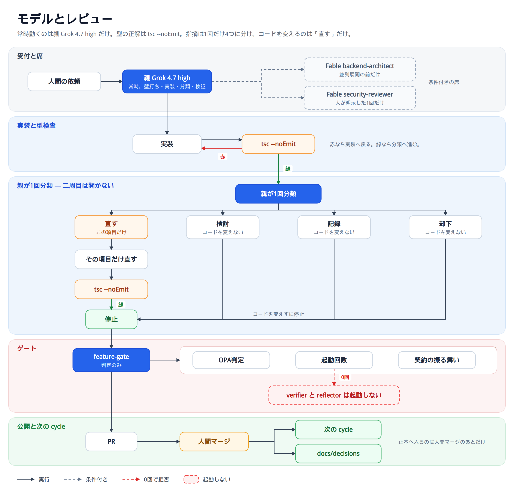
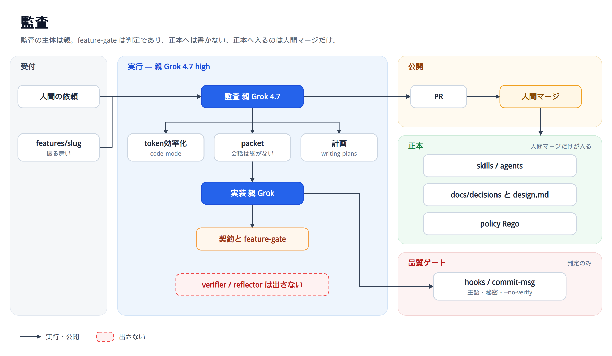
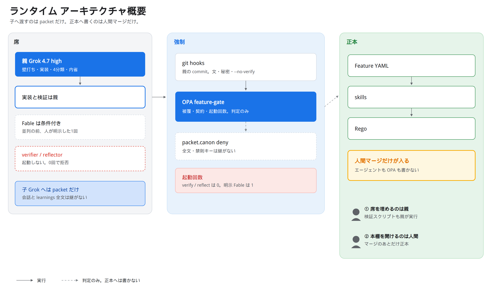
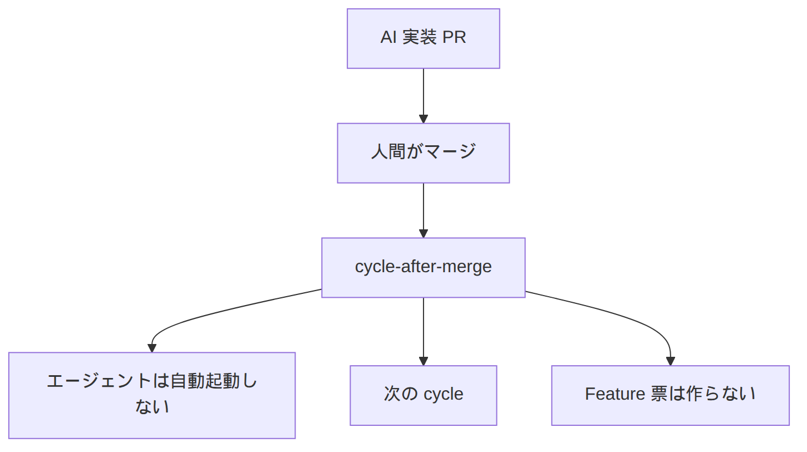

# cursor-harness

Cursor ハーネスの**テンプレート**。対象は席・正本・ゲート・cycle（[ADR 0039](docs/decisions/0039-harness-template-cycle-graph.md)）。
ライセンスは [MIT](LICENSE)（Copyright (c) 2026 marumo333）。

## 実行環境

開発の正は **Cursor のクラウド**（Cloud Agent）と GitHub Actions（`ubuntu-latest`）。
ゲート（`feature-gate` / OPA）は Linux amd64 にピン留めする。macOS / Windows / Linux arm64 では動かない。
手元の clone は閲覧と空リポへの載せに使う。commit とゲートはクラウドまたは Actions で通す。

## 何をするか

- 席: 親 Grok 4.7 high。検証は親が契約と feature-gate を実行する。検証用の subagent は出さない
- 機能の正本は `features/<slug>/` の振る舞いとテスト。機能ごとに ADR、レビュー、proposed、admitted は作らない
- ゲート: OPA `node scripts/feature-gate.mjs`（自己改善ループそのものではない）
- 管理: skill の使用/省略を `cycle/` に書き、ノード / 辺 / 状態の3指標で計る
- 再起: 人間がマージすると次の cycle が開く。Feature 票は開かない。エージェントは自動起動しない
- パッケージ: pnpm（[ADR 0041](docs/decisions/0041-pnpm-package-manager.md)）
- commit: hook 必須。主語は `feat:` / `fix:` / `docs:` 等 + 日本語（[ADR 0042](docs/decisions/0042-always-on-precommit-ja-conventional.md)）

手順の本体は [TEMPLATE.md](TEMPLATE.md)。

## 最初にやること

Cursor のクラウドでリポを開く。このリポジトリの clone 後は `pnpm install`（hooks も入る）。プロダクトの始め方は [TEMPLATE.md](TEMPLATE.md) の「プロダクトを始める」。機能ごとに ADR は起票しない。

空リポへ載せる手順は [TEMPLATE.md](TEMPLATE.md)。
完了はクラウドまたは Actions 上で `node scripts/feature-gate.mjs` が緑であること。ハーネスにテストがある変更は `pnpm test` が緑であること（[ADR 0016](docs/decisions/0016-definition-of-done.md)）。

## アーキテクチャ

このハーネスは席・ゲート・cycle で回る。入力は人間の依頼と `features/<slug>/` の振る舞い、
実行は席、token効率化は code-mode と packet、品質ゲートは hooks / OPA / feature-gate、
成果は振る舞いのテストと `docs/decisions/` と policy、フィードバックは次の cycle である。
監査の主体は親 Grok 4.7 high である。Uber の Gateway や艦隊は置かない。feature-gate は OPA の検査と契約とレビュー上限を実行する。canon の一覧は opa test が検査し、差分の被覆には使わない。正本へは書かない。

図は [`docs/architecture/`](docs/architecture/) のアーキテクチャ概要。実線は実行、破線は条件付きか判定のみ。編集する正は同ディレクトリの mermaid（[`review-overview.mmd`](docs/architecture/review-overview.mmd) ほか）。README には画像だけを出す。

### モデルとレビュー

常時動くのは親エージェント Grok 4.7 high だけ。型の正解は `tsc --noEmit`。品質の指摘は親が1回、4つに分ける。コードを変えるのは直すだけ。緑のあと二周目は開かない。Fable の backend-architect は並列展開の前だけ、security-reviewer は人が明示した1回だけ。verifier と reflector は起動せず、feature-gate が 0 回で拒否する。



### 監査

受付 → 親が計画と実装 → 契約と feature-gate → 公開。
必須の辺は無い。検証用の subagent は出さない。
feature-gate は判定であり、正本へは書かない。正本へ入るのは人間マージだけ。



### ランタイム

席と強制の層。子へ渡すのは packet だけ。会話履歴と `docs/learnings.md` の全文は継がない。
hooks を踏むのは実装の commit。feature-gate は判定であり正本へは書かない。
`packet.canon` の deny は `cycle-record` が dispatch を書くときに評価する。



### 再起的自己改善

人間のマージが点火する。cycle-after-merge は承認を記録し、次の cycle を開く。Feature 票は作らない。エージェントは自動起動しない。正本に残るのは `docs/decisions` と `features/<slug>/` だけ。



## 構成

```
.claude/          エージェント / skill / hook
.cursor/          Cursor の hook
docs/decisions/   人の判断
docs/learnings.md 実行のメモ
cycle/            cycle の記録と席のピン
policy/           OPA（ゲートと cycle）
scripts/          feature-gate / cycle-* / githooks / commit-msg
```

プロダクトの始め方は [TEMPLATE.md](TEMPLATE.md) の「プロダクトを始める」。人の判断は [`docs/decisions/`](docs/decisions/)。
